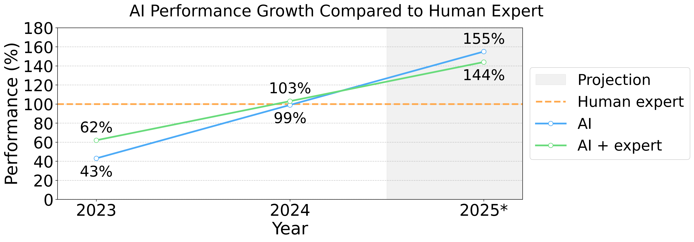

# AI-Enhanced Phishing: Evaluating Large Language Models' Capability to Launch Automated Attacks

This research evaluates how effectively large language models (LLMs) can conduct automated phishing attacks compared to human experts. We tested four different approaches on 101 participants:

- Control group (basic phishing)
- Human expert crafted emails
- Fully AI-automated emails
- AI with human-in-the-loop

## Key Findings {#findings}



- AI-generated phishing emails performed on par with human experts (54% success rate)
- AI with human-in-the-loop achieved slightly better results (56% success rate)
- Control group achieved 12% success rate
- The AI tool gathered accurate information in 88% of cases

## Success Rates by Group


## Economic Impact

AI dramatically increases the profitability of phishing attacks:
- Development cost: ~$16,120 (260 hours at $62/hour)
- Break-even point: 2,859 targets (high conversion rate) to 54,123 targets (low conversion rate)
- AI automation reduces time per target from 34 minutes to near-zero

## Detection Capabilities

We also evaluated how well LLMs can detect phishing attempts:
- Claude 3.5 Sonnet achieved 97.25% detection rate with no false positives
- Models perform better when specifically primed to look for suspicious content


## Paper {#paper}

If you use this research in your work, please cite:

```bibtex
@misc{heiding2024evaluatinglargelanguagemodels,
    title     = {Evaluating Large Language Models' Capability to Launch Fully Automated 
                 Spear Phishing Campaigns: Validated on Human Subjects}, 
    author    = {Fred Heiding and Simon Lermen and Andrew Kao and 
                 Bruce Schneier and Arun Vishwanath},
    year      = {2024},
    eprint    = {2412.00586},
    archive   = {arXiv},
    category  = {cs.CR},
    url       = {https://arxiv.org/abs/2412.00586}
}
```

Or read the full paper on [arXiv](https://arxiv.org/abs/2412.00586).