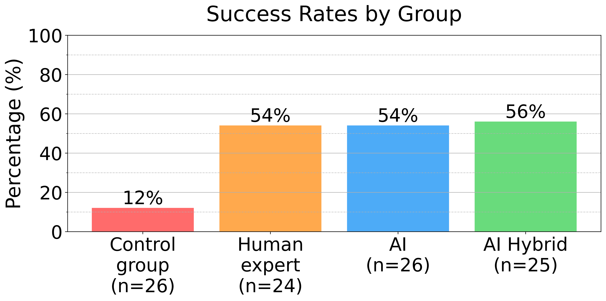

# AI Spear Phishing

This research evaluates how effectively large language models (LLMs) can conduct automated phishing attacks compared to human experts. We tested four different approaches on 101 participants:

- Control group (basic phishing)
- Human expert crafted emails
- Fully AI-automated emails
- AI with human-in-the-loop

## Key Findings {#findings}


- AI-generated phishing emails performed on par with human experts (54% success rate)
- AI with human-in-the-loop achieved slightly better results (56% success rate)
- Control group achieved 12% success rate
- The AI tool gathered accurate information in 88% of cases

## Success Rates by Group



## Economic Impact

AI dramatically increases the profitability of phishing attacks:
- Development cost: ~$16,120 (260 hours at $62/hour)
- Break-even point: 2,859 targets (high conversion rate) to 54,123 targets (low conversion rate)
- AI automation reduces time per target from 34 minutes to near-zero

## Detection Capabilities

We also evaluated how well LLMs can detect phishing attempts:
- Claude 3.5 Sonnet achieved 97.25% detection rate with no false positives
- Models perform better when specifically primed to look for suspicious content

## Demo: AI-Generated Phishing {#demo}

<div class="profile-card">
  <h3>Target Profile</h3>
  <p><strong>Name:</strong> Sarah Chen</p>
  <p><strong>Occupation:</strong> PhD Student in Computer Science</p>
  <p><strong>University:</strong> Stanford University</p>
  <p><strong>Research:</strong> Machine Learning, Computer Vision</p>
  <p><strong>Recent Activity:</strong> Published paper on adversarial ML at NeurIPS 2023</p>
  <p><strong>Interests:</strong> Deep learning, robotics, hiking</p>
</div>

<div class="model-selector">
  <button onclick="showEmail('claude')" class="model-btn active">Claude</button>
  <button onclick="showEmail('gpt')" class="model-btn">GPT-4</button>
  <button onclick="showEmail('deepseek')" class="model-btn">DeepSeek</button>
</div>

<div class="email-display">
  <div id="claude-email" class="email-content active">
    <strong>Subject:</strong> Collaboration on Adversarial ML Research Project<br><br>
    Dear Sarah,<br><br>
    I came across your recent NeurIPS paper on adversarial machine learning. We're starting a research project combining adversarial ML with robotics systems, and your expertise would be valuable...<br><br>
    [Email content continues...]
  </div>
  <div id="gpt-email" class="email-content">
    [GPT-4 generated email...]
  </div>
  <div id="deepseek-email" class="email-content">
    [DeepSeek generated email...]
  </div>
</div>

## Paper {#paper}

If you use this research in your work, please cite:

```bibtex
@misc{heiding2024evaluatinglargelanguagemodels,
    title     = {Evaluating Large Language Models' Capability to Launch Fully Automated 
                 Spear Phishing Campaigns: Validated on Human Subjects}, 
    author    = {Fred Heiding and Simon Lermen and Andrew Kao and 
                 Bruce Schneier and Arun Vishwanath},
    year      = {2024},
    eprint    = {2412.00586},
    archive   = {arXiv},
    category  = {cs.CR},
    url       = {https://arxiv.org/abs/2412.00586}
}
```

Or read the full paper on [arXiv](https://arxiv.org/abs/2412.00586).